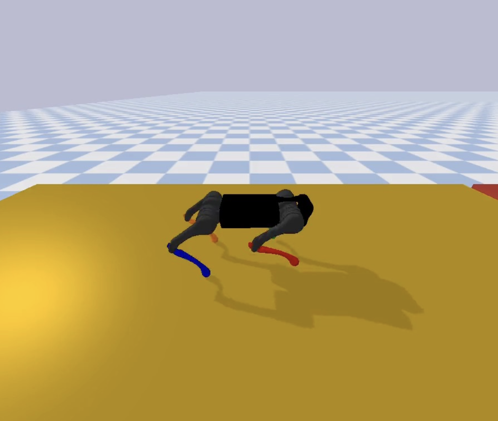

# 🐾 Quadruped-Sim

Welcome to **Quadruped-Sim**, a simulation environment for a quadruped robot!

---

  

## ✨ Installation

It is recommended to use a virtual environment (virtualenv or conda) with Python 3.6 or higher.

1. Install virtualenv via pip:

   ```bash
   pip install virtualenv
   ```

2. Create a virtual environment:

   ```bash
   virtualenv quad_env --python=python3
   ```

   *(You can replace **`quad_env`** with another name of your choice.)*

3. Activate the virtual environment:

   ```bash
   source {PATH_TO_VENV}/bin/activate
   ```

4. Your command prompt should now look like:

   ```bash
   (venv_name) user@pc:path$
   ```

5. Install the dependencies:

   ```bash
   pip install pybullet gym numpy stable-baselines3 matplotlib
   ```

---

## 🗂 Code Structure

### 🛠️ Environment & Simulation

- [**env**](./env) - Quadruped environment files:
  - [quadruped\_gym\_env.py](./env/quadruped_gym_env.py) - Gym simulation environment.
  - [quadruped.py](./env/quadruped.py) - Robot-specific functionalities (inverse kinematics, leg Jacobian, etc.).
  - [configs\_a1.py](./env/configs_a1.py) - Configuration variables.

### 🖊️ Robot Description

- [**a1\_description**](./a1_description) - Contains the robot mesh files and URDF.

### 🔄 CPG & Gait Control

- [**hopf\_network.py**](./env/hopf_network.py) - CPG class skeleton for various gaits.
- [**run\_cpg.py**](run_cpg.py) - Maps joint commands to an instance of `quadruped_gym_env`.

### 🏆 Reinforcement Learning

- [**run\_sb3.py**](./run_sb3.py) & [**load\_sb3.py**](./load_sb3.py) - Interfaces for training RL algorithms using [Stable-Baselines3](https://github.com/DLR-RM/stable-baselines3).

### 📝 Utilities

- [**utils**](./utils) - File I/O and plotting helpers.

---

## 📚 Code Resources

- 📚 [PyBullet Quickstart Guide](https://docs.google.com/document/d/10sXEhzFRSnvFcl3XxNGhnD4N2SedqwdAvK3dsihxVUA/edit#heading=h.2ye70wns7io3)
- 🌟 Inspired by [Google's motion-imitation repository](https://github.com/google-research/motion_imitation) ([Paper](https://xbpeng.github.io/projects/Robotic_Imitation/2020_Robotic_Imitation.pdf))
- 🤖 RL frameworks: [Stable-Baselines3](https://github.com/DLR-RM/stable-baselines3), [Ray RLlib](https://github.com/ray-project/ray), [SpinningUp](https://github.com/openai/spinningup)

---

## 🧐 Conceptual Resources

The CPG and RL framework are based on:

- **CPG-RL: Learning Central Pattern Generators for Quadruped Locomotion** - IEEE Robotics and Automation Letters, 2022
  - [IEEE](https://ieeexplore.ieee.org/abstract/document/9932888)
  - [arXiv](https://arxiv.org/abs/2211.00458)
- **Robust High-speed Running for Quadruped Robots via Deep RL** - IROS 2022
  - [arXiv](https://arxiv.org/abs/2103.06484)

---


## 🚀 Train in Isaac Lab (A1)

You can now launch Isaac Lab training directly from this repo using:

```bash
python run_isaac_training.py --isaaclab-path /path/to/IsaacLab --headless
```

Notes:
- If `--isaaclab-path` is omitted, the script reads `ISAACLAB_PATH`.
- Default task is `Isaac-Velocity-Flat-Unitree-A1-v0`.
- The launcher forwards options like `--num-envs`, `--max-iterations`, `--seed`, and checkpoint resume.

Example:

```bash
export ISAACLAB_PATH=/opt/IsaacLab
python run_isaac_training.py --num-envs 4096 --max-iterations 2000 --headless
```

## 💡 Tips & Tricks

- ⚡ If your simulation is slow, remove `time.sleep()` calls and disable camera resets in [quadruped\_gym\_env.py](./env/quadruped_gym_env.py).
- 🎨 Modify the camera viewer in `_render_step_helper()` in [quadruped\_gym\_env.py](./env/quadruped_gym_env.py) to track the quadruped.

---

Enjoy simulating your quadruped! 🦜🚀

